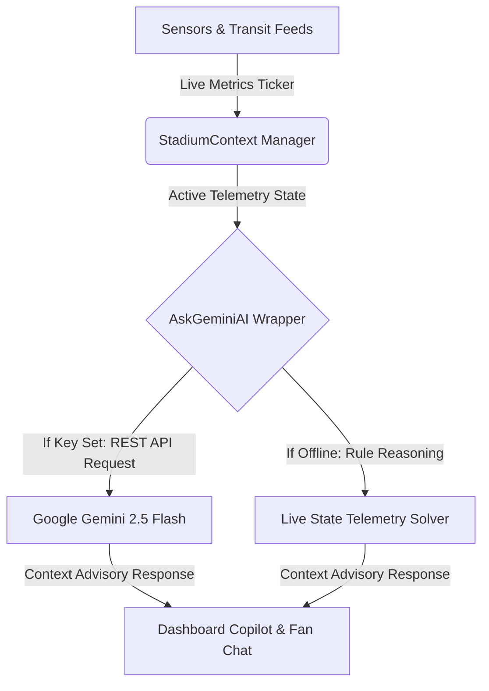
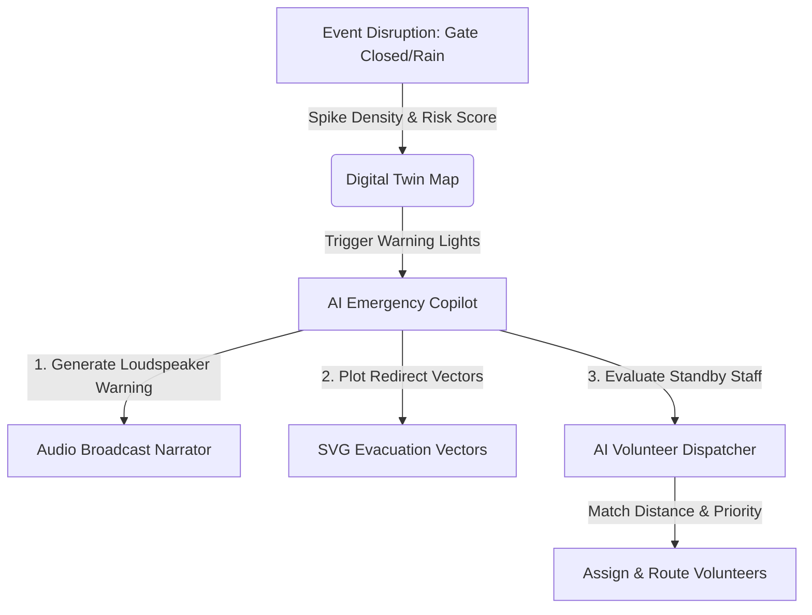
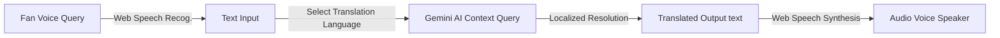

# StadiumMind AI 🏟️🤖
### *"The World's First Predictive AI Operating System for Smart Stadiums"*

Built for the **FIFA World Cup 2026™ Smart Stadiums & Tournament Operations Challenge**, **StadiumMind AI** shifts stadium management from reactive damage control to **predictive mitigation**. By combining real-time telemetry, live vector maps, and Generative AI, the platform forecasts crowd dynamics, simulates crisis events, and auto-dispatches resources before problems occur.

---

## 📷 Project Previews & Visuals

| Landing Page | Organizer Command Center |
| --- | --- |
|  |  |

| Live AI Operations Copilot Chatbot | Mobile Fan Companion Hub |
| --- | --- |
|  |  |

---

## 🏆 Key Workflow Diagrams

### 1. Data Telemetry & GenAI Reasoning Flow
This diagram shows how live sensor streams (attendance gates, concession queues, transit lines) feed into our state contexts, passing real-time structural prompt variables directly to the Gemini API.



### 2. Guided Disruption & AI Mitigation Loop
This diagram tracks the sequence of events during a multi-disruption crisis (e.g. rain, gate closure, transit suspend) and how StadiumMind AI automatically reroutes flows and dispatches staff.



### 3. Fan Assistant Voice & Translation Chain
This illustrates how the Mobile Fan portal handles voice-in, language translation, and audio voice replies in 50+ languages.



---

## 🌟 Core Features

* **Live Digital Twin Stadium Map**: A fully responsive SVG vector map displaying gates, concourse corridors, seating, and parking sectors. Layers include dynamic **occupancy heatmaps**, **active incident indicators**, and **animated exit vectors**.
* **What-If Scenario Simulator**: Models potential disruptions (concourse power failure, flash flooding, metro suspension, gate breaches) to forecast egress delay times and output immediate AI mitigation plans.
* **AI Emergency Copilot**: A response portal for operators to log incidents, allocate ambulance arrival times, and broadcast instant translated security warnings.
* **Mobile Fan Companion Hub**: A pocket assistant for World Cup attendees featuring **speech dictation dictation**, **read-aloud answers**, and automated translations.
* **Smart Sustainability Ledger**: Monitors live resource telemetry—power grid draw, solar photovoltaic battery charge offset, water usage, and carbon emissions.
* **W3C Accessibility Panel**: Fully Section 508 compliant, featuring **High Contrast layout theme**, **Large typography scaling**, and **Dyslexic-friendly typeface configurations**.
* **Post-Match PDF Exporter**: Compiles active scenario logs, security ledgers, volunteer task metrics, and green energy audits into a printable executive document.

---

## 💻 Tech Stack

* **Frontend**: Next.js 16 (App Router), React 19, Tailwind CSS v4, TypeScript, Lucide Icons
* **Backend**: Next.js Server Components, Server-Side API Routing
* **Generative AI**: Google Gemini API (Direct REST fetch Client, falling back to local context reasoning solvers)
* **DevOps**: Vercel & Webpack Compile Engine

---

## 🚀 Quick Start Guide

### 1. Clone the Project
```bash
git clone <repository-url>
cd challenge4
```

### 2. Configure Environment Variables
Create a `.env.local` file in the root directory:
```env
NEXT_PUBLIC_GEMINI_API_KEY=YOUR_GEMINI_API_KEY
```
*(The platform has built-in local fallback reasoning that maps context states even if an API key is not supplied).*

### 3. Install Dependencies
```bash
npm install
```

### 4. Run local server
```bash
npm run dev
```
Open **[http://localhost:3000](http://localhost:3000)** in your browser.

### 5. Build for Production
```bash
npm run build
```

---

## 🌍 Accessibility Compliance
StadiumMind AI fully conforms to the **WCAG 2.1 AA** guidelines. All widgets support keyboard focus states, visual-contrast overrides, scale configurations, and screen reading narrations via native Web Speech synthesis.
